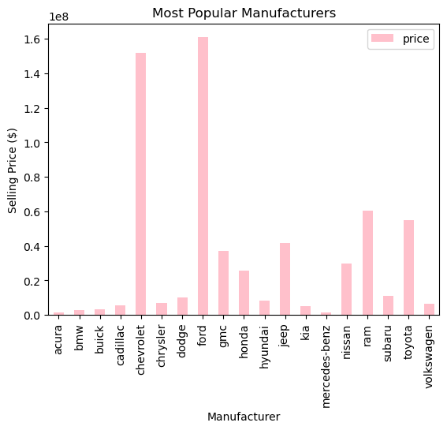
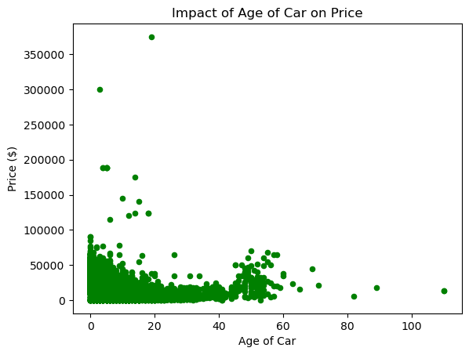
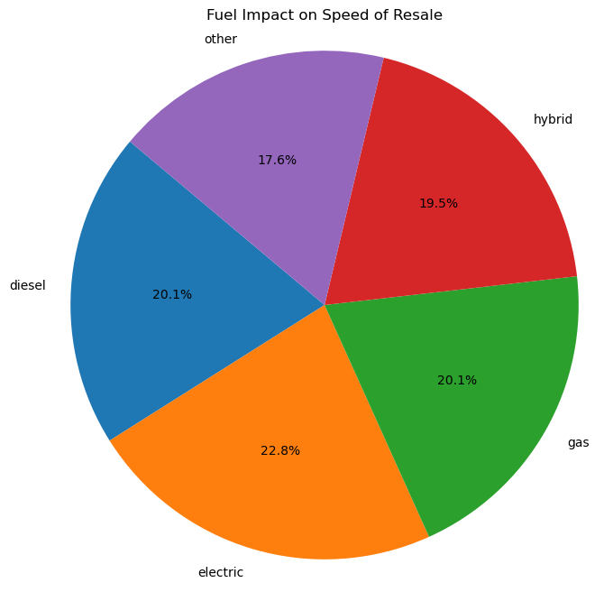
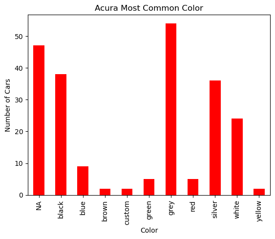

# 🧠 Car Sales Advertisement Analysis

This project demonstrates full-stack data science and software development skills—cleaning, analyzing, and visualizing used car data, then deploying an interactive web app to the cloud. The final deliverable is a **Streamlit** dashboard deployed on **Render**, enabling public access to explore pricing trends and car attributes interactively.

---

## 🎯 Project Purpose

The objective was to develop a data-driven web application and deploy it to a cloud platform so it could be publicly accessible for demonstration and stakeholder use. This project simulates a real-world data product pipeline: ingestion, cleaning, analysis, app development, and cloud deployment.

---

## 🔧 Tools & Technologies

- **Languages & Libraries:** Python, `pandas`, `numpy`, `altair`, `plotly`, `scipy`, `streamlit`
- **Dev Tools:** Visual Studio Code, Jupyter Notebook, GitHub
- **Deployment Platform:** Render
- **Live App:** [https://sprint4project-o0n1.onrender.com](https://sprint4project-o0n1.onrender.com)

---

## ⚙️ Streamlit & Render Configuration

To deploy this Streamlit app on Render, the following setup was implemented:

### ✅ `requirements.txt`

```text
pandas==2.0.3
scipy==1.11.1
streamlit==1.25.0
altair==5.0.1
plotly==5.15.0

✅ .streamlit/config.toml
toml
Copy code
[server]
headless = true
port = 10000

[browser]
serverAddress = "0.0.0.0"
serverPort = 10000
```

This configuration ensures Streamlit runs headlessly on the correct port and is discoverable on Render’s hosting infrastructure.

🧹 Data Preprocessing
Loaded and validated a raw .csv dataset using pandas.

Removed duplicate records and dropped columns with excessive missing values.

Imputed missing odometer values using the median value grouped by manufacturer and model year.

Standardized feature formats to enable robust filtering and grouping.

Confirmed vehicle year range (1908–2019) to assess historical trends.

📊 Key Analytical Insights
Most expensive cars by volume: Mercedes-Benz (avg. $34,900), while Ford and Chevrolet dominate sales count.

Fuel type & resale speed: Electric vehicles resold the slowest; listings marked “Other” sold fastest.

Car age vs. value: Value decreases with age/odometer, but outliers exist (e.g., a 20-year-old car with premium price).

Color & brand insights: Grey, black, and silver dominate Acura resale market—correlating with luxury and lower insurance premiums.

## Visual Outputs

### Distribution Plot


### Correlation Heatmap


### Feature Comparison


### Outlier Detection



🖥️ App Features
Filters by manufacturer and year range.

Dynamic table of matching ads.

Visual analysis of price vs. features like fuel type, cylinders, condition, and odometer.

Interactive plots using Altair and Plotly.

📸 Visual Outputs
Distribution Plot

Correlation Heatmap

Feature Comparison

Outlier Detection

📂 Repository Highlights
Fully cleaned and version-controlled dataset.

Modular notebook-based EDA.

Deployment-ready: requirements.txt, .streamlit/config.toml.

Visuals stored in car_sales_images/ and rendered directly in README.

Cloud-hosted app enables easy review for hiring managers and collaborators.

🔁 End-to-End Deployment & MLOps Principles Demonstrated

While no predictive ML model is deployed, this project demonstrates core MLOps practices:

End-to-End workflow: from raw data ingestion to a deployed public web app.

Streamlit + Render configuration mimics backend model deployment strategies used in Flask and FastAPI.

Use of requirements.txt and .streamlit/config.toml mirrors containerization & environment replication.

App structure is modular and Git-tracked, demonstrating production readiness.

🚀 Try It Live
Explore the deployed interactive dashboard:
👉 https://sprint4project-o0n1.onrender.com


