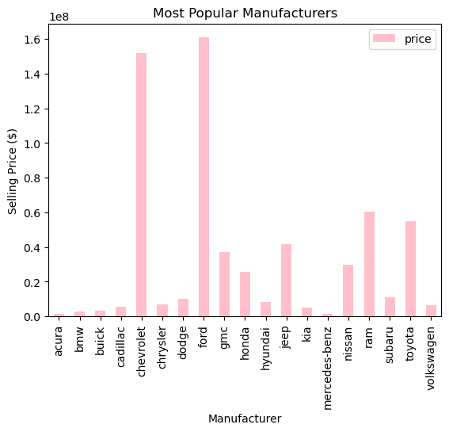
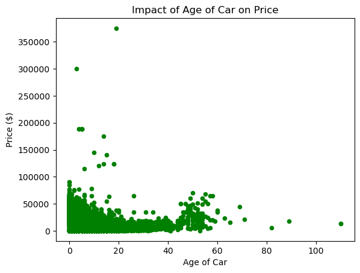
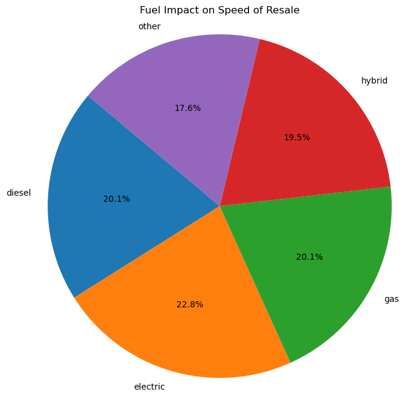
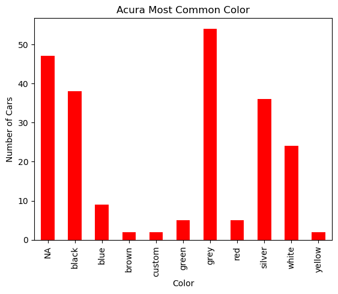

# 🧠 Car Sales Advertisement Analysis

This project demonstrates full-stack data science and software development skills—cleaning, analyzing, and visualizing used car data, then deploying an interactive web app to the cloud. The final deliverable is a **Streamlit** dashboard deployed on **Render**, enabling public access to explore pricing trends and car attributes interactively.

---

📊 From Listings to Insights: Understanding the Used Car Market with Python and Streamlit
In a world where buying a used car can feel like a gamble, I wanted to understand: what really drives price—and how long a car sits unsold?

This project dives into a dataset of over 50,000 used vehicle listings from the U.S., sourced from an online marketplace. With a focus on data cleaning, feature engineering, and interactive analysis, I built a Streamlit web app that lets users explore how car price is influenced by variables like mileage, condition, fuel type, and transmission.

The app enables real-time exploration of questions like:

Which manufacturers dominate which price ranges?

Do diesel cars sell faster than gas?

How does a car’s age or mileage affect resale value?

Behind the scenes, I used Python (Pandas, Plotly) to clean and preprocess the data—handling missing values, parsing text columns, calculating car age, and grouping manufacturers. The UI, built in Streamlit, connects users to those insights with interactive plots and custom filters deployed through Render.

This project doesn’t just show I can analyze data. It shows I can turn messy datasets into actionable tools, communicate results visually, and deploy them on the web—skills essential for building industry-grade ML and analytics products.

---
### 🚀 Techniques Demonstrated in This Project

| **Skill Area**           | **Tools / Techniques Used**                                                                                          | **Description**                                                                                      |
|--------------------------|-----------------------------------------------------------------------------------------------------------------------|--------------------------------------------------------------------------------------------------------|
| **Version Control**      | Git, GitHub                                                                                                           | Tracked changes, managed branches, and collaborated on codebase using Git and GitHub.                 |
| **Web Deployment**       | Render, Streamlit, Command Line                                                                                       | Deployed an interactive Streamlit app using Render with CLI-based deployment workflows.               |
| **Data Cleaning**        | Pandas                                                                                                                | Handled missing values, type conversion, duplicate removal, and feature engineering.                  |
| **Data Visualization**   | Plotly, Streamlit                                                                                                     | Created interactive charts (histograms, scatter plots) for real-time exploratory data analysis.       |
| **UI Components**        | Streamlit Widgets                                                                                                     | Integrated dropdowns, sliders, and checkboxes to dynamically filter data and update plots.            |
| **Feature Engineering**  | Datetime, String Manipulation, Custom Functions                                                                       | Created new columns such as `age_of_car` and `age_category` for deeper analysis.                      |
| **Exploratory Analysis** | Groupby operations, aggregations (median, sum, count)                                                                 | Investigated how fuel type, transmission, and vehicle age affect price and time-on-market.            |
| **Reproducibility**      | .csv data handling, CLI startup, modular code structure                                                               | Ensured the app runs consistently with well-structured scripts and modular logic.                     |

---
## 🔧 Tools & Technologies

- **Languages & Libraries:** Python, `pandas`, `numpy`, `altair`, `plotly`, `scipy`, `streamlit`
- **Dev Tools:** Visual Studio Code, Jupyter Notebook, GitHub
- **Deployment Platform:** Render
- **Live App:** [https://sprint4project-o0n1.onrender.com](https://sprint4project-o0n1.onrender.com)

---

## ⚙️ Streamlit & Render Configuration

To deploy this Streamlit app on Render, the following setup was implemented:

### ✅ `requirements.txt`

```text
pandas==2.0.3
scipy==1.11.1
streamlit==1.25.0
altair==5.0.1
plotly==5.15.0

✅ .streamlit/config.toml
toml
Copy code
[server]
headless = true
port = 10000

[browser]
serverAddress = "0.0.0.0"
serverPort = 10000
```

This configuration ensures Streamlit runs headlessly on the correct port and is discoverable on Render’s hosting infrastructure.

🧹 Data Preprocessing
Loaded and validated a raw .csv dataset using pandas.

Removed duplicate records and dropped columns with excessive missing values.

Imputed missing odometer values using the median value grouped by manufacturer and model year.

Standardized feature formats to enable robust filtering and grouping.

Confirmed vehicle year range (1908–2019) to assess historical trends.

📊 Key Analytical Insights
Most expensive cars by volume: Mercedes-Benz (avg. $34,900), while Ford and Chevrolet dominate sales count.

Fuel type & resale speed: Electric vehicles resold the slowest; listings marked “Other” sold fastest.

Car age vs. value: Value decreases with age/odometer, but outliers exist (e.g., a 20-year-old car with premium price).

Color & brand insights: Grey, black, and silver dominate Acura resale market—correlating with luxury and lower insurance premiums.

## Visual Outputs

### Distribution Plot


### Correlation Heatmap


### Feature Comparison


### Outlier Detection



🖥️ App Features
Filters by manufacturer and year range.

Dynamic table of matching ads.

Visual analysis of price vs. features like fuel type, cylinders, condition, and odometer.

Interactive plots using Altair and Plotly.

📸 Visual Outputs
Distribution Plot

Correlation Heatmap

Feature Comparison

Outlier Detection

📂 Repository Highlights
Fully cleaned and version-controlled dataset.

Modular notebook-based EDA.

Deployment-ready: requirements.txt, .streamlit/config.toml.

Visuals stored in car_sales_images/ and rendered directly in README.

Cloud-hosted app enables easy review for hiring managers and collaborators.

🔁 End-to-End Deployment & MLOps Principles Demonstrated

While no predictive ML model is deployed, this project demonstrates core MLOps practices:

End-to-End workflow: from raw data ingestion to a deployed public web app.

Streamlit + Render configuration mimics backend model deployment strategies used in Flask and FastAPI.

Use of requirements.txt and .streamlit/config.toml mirrors containerization & environment replication.

App structure is modular and Git-tracked, demonstrating production readiness.

🚀 Try It Live
Explore the deployed interactive dashboard:
👉 https://sprint4project-o0n1.onrender.com


